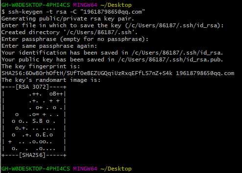

### `Windows`下`GitHub`的`SSH key`配置

> `SSH key`是一种方法来确定受信任的计算机，从而实现免密码登录。
>
> `Git`是分布式的代码管理工具，远程的代码管理是基于`SHH`的，所以要使用远程的`Git`则需要`SSH`的配置。
>
> 下面的步骤将完成**生成`SSH`密钥**并**添加公钥到`GitHub`上的账户。**

#### 先设置`GitHub`的`user name`和`email`

```sh
git config --global user.name "er2q" 
git config --global user.email "1961879865@qq.com"
```

#### 生成一个新的`SSH`密钥

> 打开`Git Bash`或`CMD`，输入如下命令，然后连续按三个回车键：

```sh
ssh-keygen -t rsa -C "1961879865@qq.com"
```



> 注：生成的`SSH`私钥路径`/c/Users/86187/.ssh/id_rsa`，后面要用到。

#### 将`SSH`私钥添加到`ssh-agent`

> 配置`ssh-agent`程序使用`SSH key
>
> 1.在后台启动`ssh-agent`
>
> `eval $(ssh-agent -s)`
>
> 2.将`SSH`私钥添加到`ssh-agent`
>
> `ssh-add /c/Users/86187/.ssh/id_rsa`


#### 将`SSH`公钥添加到`GitHub`账户

> 配置`GitHub`账户使用`SSH key`
>
> 1.先复制`SSH`公钥的完整内容`/c/Users/86187/.ssh/id_rsa.pub`
>
> `clip < /c/Users/86187/.ssh/id_rsa.pub`
>
> 2.进入`GitHub`的设置页面（登录`GitHUb`，在右上角，点击`Settings`）
>
> 
>
> 3.点击左部侧边栏的`SSH and GPG keys`选项
>
> 
>
> 4.点击`new SSH key`按钮
>
> 
>
> 5.在`Title`输入框内，为你的新`key`取个名字，在`key`输入框内，粘贴前面复制好的公钥内容，然后点击`Add key`按钮即可。
>
> 

#### 问题

##### ssh: connect to host github.com port 22: Connection timed out

> 在`.ssh`目录中创建`config`文件，编辑内容
>
> ```sh
> Host github.com
> User 注册github的邮箱
> Hostname ssh.github.com
> PreferredAuthentications publickey
> IdentityFile ~/.ssh/id_rsa
> Port 443
> ```

### SSH推送代码
> git remote add origin git@github.com:er2q/mmcv_study.git
> 
> git push -u origin master
