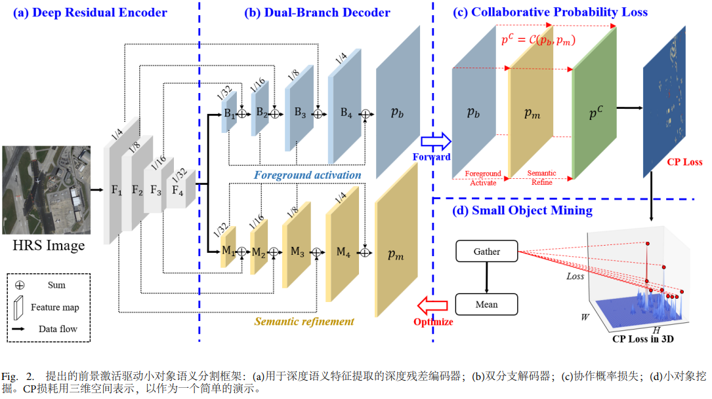
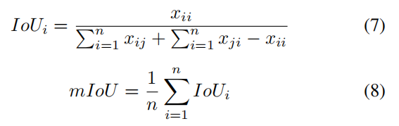
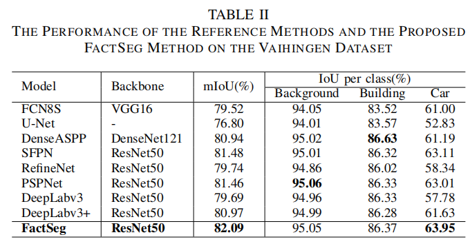
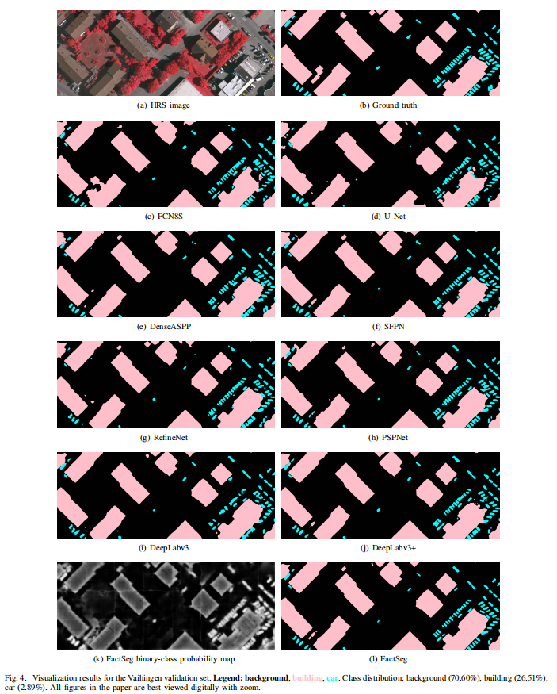
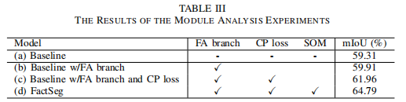
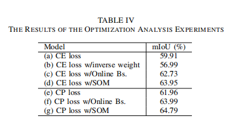
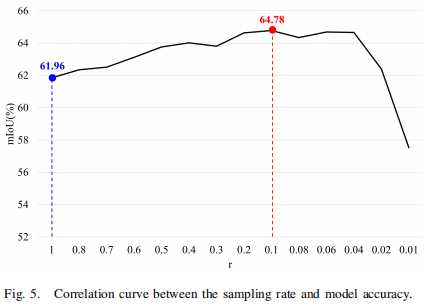
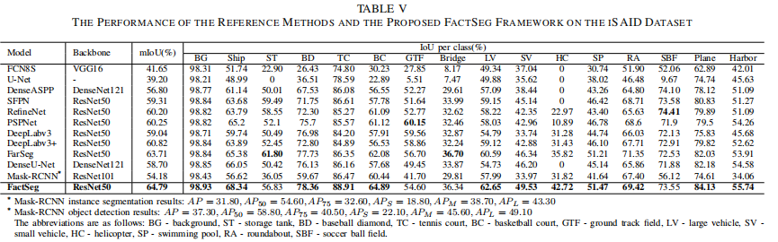
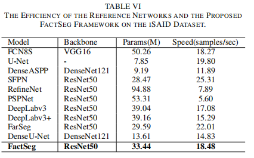
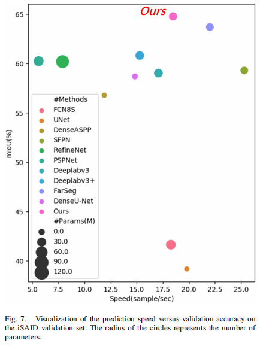

# FactSeg：前景激活驱动的小对象语义分割

**摘要**-小对象语义分割任务的目的是从高分辨率遙感(HRS)图像中自动提取关键对象。与遥感图像覆盖区域相比，汽车、船舶等关键对象。在HRS中，图像通常只包含几个像素。为了解决这一问题，本文从结构和优化的角度提出了前景激活(FA)驱动的小对象语义分割(`FactSeg`)框架。在结构设计中。提出了FA对象表示，以提高对小对象弱特征的感知。FA对象表示框架由一个双分支解码器和协同概率(`CP`)损失组成。在双分支解码器中，FA分支被设计用来激活小对象特征（激活)，同时抑制大尺度背景，语义细化(SR)分支被设计用来进一步区分小对象(细化)。在`CP`假设下。提出`CP`损失有效地结合解码器的激活和细化输出。在协作过程中，小对象的弱特性随着激活输出而增强，细化的输出可以看作是二进制输出的细化。在优化阶段，采用基于小对象挖掘(`SOM`)的网络优化，自动选择有效样本，细化优化的向，同时解决小对象与大规模背景之间的样本不平衡的问题。利用两个基准的HRS图像分割数据集获得的实验结果表明，该框架优于现有的语义分割方法,并在精度和效率之间取得了良好的权衡。代码将可在以下位置获得:[https://github.com/Junjue-Wang/FactSeg.](https://github.com/Junjue-Wang/FactSeg)

**关键词：高分辨率  遥感图像  深度学习  分割  小对象**

### 1.介绍

目前正在从机载和空载平台获得大量的高分辨率遥感(HRS)图像，为测绘和观测提供了基础数据。与低分辨率图像相比，HRS图像包含更多的细节，这意味着小物体可见。然而，这也带来了挑战，因为关键对象可能非常小，而且它们通常只占大尺度区域中所有像素的很小的比例。在过去的几十年中，在开发用于HRS影像映射和更新的各种特征表示方法方面做出了广泛的努力。

语义分割，又称像素级分类，是介于原始图像和向量图层之间的一个重要的中间步骤。小对象语义分割是语义分割的一种特殊情况，它只关注关键对象的识别。这些关键对象也被称为前景对象，与背景相比，这是不友好的。标准的小对象语义分割问题是首先从背景中提取前景对象，然后在像素级上预测前景对象内的条件概率

以往的研究大多将小对象语义分割视为一个传统的语义分割问题。然而，传统的语义分割方法纯粹依赖于手工制作的光谱和空间特征，它不容易拟合一个复杂的分布。深度学习目前已经成为一系列图像分析任务的最新技术，许多经典的卷积神经网络(CNNs)已经成功地应用于HRS图像语义分割中。与传统的手工特征相比，深度学习方法是数据驱动的方法，其中两个代表性特征是端到端分层学习的。虽然利用深度学习方法提高了HRS图像分割的性能，但以往的工作大多直接采用了先进的cnn，但修改较小，对小物体的识别能力较差。远距离观测为HRS影像语义分割带来了独特的特征。与自然图像相比，HRS 影像通常覆盖大比例区域，而前景对象通常仅包含几个像素。例如，航空影像实例分割 （iSAID） 数据集 中的每个图像覆盖数平方公里，而车辆等关键对象仅覆盖约 10 平方米。在图1中，HRS图像取自iSAID数据集，其中背景占像素的98.66%，关键对象仅占像素的1.34%。小对象和大规模背景在HRS分割任务中导致了两个特定的困难，如下：

- 弱特征：前景对象通常只包含几个像素，留下最小的外观线索来利用。传统的cnn采用统一的滑动窗口采样，没有重点，因此cnn很难提取出足够多的不同特征来进行小对象的语义分割。
- 不平衡样本：不感兴趣的背景样本的数量显著超过前景样本的数量。大尺度的背景区域包含大量的同性质样本，易于区分。相比之下，罕见的前景区域包含稀少和复杂的样本，难以分类。这种不平衡的样本问题会在训练过程中误导优化的方向，使CNN关注简单的样本而不是困难样本。

如图1(a)所示，传统的HRS图像对象语义分割任务被视为传统的具有端到端全卷积神经网络的多类语义分割任务，这是一种没有适当考虑上述困难的方法。本文基于一种新的工作流程，提出了针对HRS图像的`FactSeg`框架，如图1(b).所示该框架从表示和优化的新角度解决了小对象语义分割任务。前景激活(FA)对象表示框架由一个双分支解码器和CP损耗组成。这有效地抑制了背景干扰，同时也增强了小物体的特征。在模型优化阶段，设计了小目标挖掘(SOM)策略，以自动选择有效样本来解决不平衡样本问题。该方法为HRS小对象语义分割任务提供了一种有效的选择。本文的贡献可以总结如下：

1) **前景激活对象表示。**与以往研究的方法不同的是，HRS图像语义分割任务被分解为两个子任务：1)二进制类激活，即类不可知的小对象激活；和2)多类细化，即在二进制类激活的指导下进行多类特征细化。该FA策略对分割任务进行分解，插入二进制类分割作为中间步骤，通过以下两个模块实现：

   - 双分支解码器。为了获得经典的激活和细化语义特征，提出了一种有效的双分支解码器，即由一个FA分支和一个语义细化(SR)分支组成的双解码器。FA分支设计用于激活小对象（激活），同时也抑制大规模背景，而SR分支设计用于对这些对象特征的细粒度识别（细化）。每个分支由一个特征金字塔网络(FPN)的变体组成，其目的是获得激活和细化特征。
   - 协同概率(CP)损失。由于双分支解码器既具有激活又具有细化语义输出，因此提出了CP损失来有效地融合输出。假设FA分支的输出产生二进制类概率，可用于在像素级激活小对象。激活输出用于类不可知的小对象引导，而细化输出用于细化激活结果。此外，还提出了CP假设作为支持，并引入了CP损失函数。基于FA策略，CP损失函数可以在概率水平上融合输出的两个分支，从而提高了优化效率。

   FA对象表示框架基于从粗到细的方法，因此类似于YOLO。但是，由于YOLO是一个目标检测框架，而FactSeg是一个语义分割框架，因此这两种方法在任务和实现上都有所不同。与以往传统的语义分割工作流相比，FA对象表示框架不仅提高了提取关键特征的能力，而且通过减少大尺度背景下的干扰，减轻了SR分支的负担。

2) **基于小对象挖掘的网络优化。**与大尺度背景相比，HRS图像中的小物体通常只有几个像素。因此，不平衡的样本会误导CNN的优化方向，这在HRS图像小对象语义分割任务中基于深度学习的方法中尤其如此。为了解决这一问题，该框架采用了基于`SOM`的网络优化方法。在训练过程中，对像素级的样本按其损失进行排序。具有高损耗的样品被认为是有效的，可以选择进行反向传播。在本研究中进行的实验表明，最有效的样本是在小的物体中。该`SOM`策略细化了模型优化的方向。

所提出的FactSeg方法在两个大规模的HRS图像语义分割数据集上实现。比较实验和烧蚀实验均在相同的实验设置下进行。对FactSeg和参考网络进行了准确性和效率方面的测试。实验结果表明，FactSeg算法优于现有的语义分割方法。

本文的其余部分组织如下：第二节介绍了语义分割和不平衡样本的相关工作。第三节描述了FactSeg的总体框架和关键组件。在第四节中，我们描述了旨在彻底评估每个所提出的模块的有效性的实验，并将FactSeg与其他参考语义分割cnn进行了比较。在第五节中，使用一些典型的大规模复杂场景，演示了FactSeg在HRS图像应用中的潜力。最后，第六节给出了我们的结论和未来的研究方向。

### 2.相关工作

A. 遥感中的语义分割

下面将介绍重要的语义分割工作。在过去的几十年里，卫星和航空图像的语义分割得到了广泛的研究。传统的方法通常旨在设计更鲁棒的特征。典型的输入特征包括光谱和空间特征，如原始像素强度、对象索引，以及描述局部图像纹理[14]-[17]的不同统计数据或滤波器响应。例如，Wang和Ming[18]将光谱和形状特征整合到道路提取过程中；Huang等[19]提出了一个通过同时考虑光谱、几何和背景信息来描述建筑特征的后处理框架，在很大程度上减轻了误报警的数量。提高分割性能的另一种方法是选择包括有效特征选择的类符（例如，增强、决策树和随机森林分类器）。计算冗余特征后，这些分类器自动选择最优子集以减少相关信息[20]。条件随机场(CRF)模型是一种无向图形化方法，它可以对全局上下文信息进行建模。Wang等人[6]利用CRF框架内的Gabor纹理特征，实现了城市森林覆盖映射。为了充分利用空间上下文信息和拓扑信息，Huang[7]等人提出了一种基于对象的道路提取CRF模型。然而，这些具有手工制作特征的传统方法往往难以描述复杂的模式和分布。深度学习是计算机视觉和模式识别的热点，代表性特征和语义特征被分层自动学习[21]。全卷积网络(FCN)及其扩展已被广泛应用于遥感领域，以处理语义分割任务[22]-[24]。同时，开发了大规模像素级标记的HRS图像数据集[25]，促进了遥感领域深度学习的发展。基于Wang等数据集，[9]提出了一个遥感神经网络(RSNet)搜索框架来自动设计识别架构。然而，这些语义分割CNN是直接从高级的CNN架构中使用或修改的，而没有考虑HRS图像中小对象内部的弱特征。因此，这些方法不适用于HRS图像中的小对象语义分割任务。

与自然图像相比，使用HRS图像会导致更小的物体识别问题。例如，Wang等人[26]提出了一个用于船舶探测任务的合成孔径雷达数据集，这是在复杂背景场景下进行小物体识别的一个很好的例子。对于视频卫星处理，LaLonde等[27]提出了利用时空信息来检测大场景中的小物体。小物体的鲁棒检测也得到了广泛的研究。

对于HRS图像，Dong等人[30]利用Sig-NMS模块处理了小目标检测任务，减少了小目标缺失的可能性。Pang等人[31]还提出了一种统一的自强迫网络来抑制微小物体检测中的假阳性。小对象语义分割也在研究中。例如，滨口等人的[2]有效地采用了扩张卷积，以保持小物体的高空间分辨率细节。[1]等人利用支持向量机对小物体的不确定像素进行了细化，从而提高了分割精度。Zheng[32]等人[32]设计了一个前景感知关系网络，利用一维场景嵌入向量对前景与地理空间场景之间的关系进行建模，从而提高了前景特征的识别能力。然而，该方法仅通过非线性变换隐式地将前景与场景关联起来。Dong[33]等人[33]提出了用于城市遥感图像小对象语义分割的DenseUNet，其中DenseU-Net通过级联操作连接CNN特征，将浅层的细节特征融合，深层抽象的语义特征融合。本文提出的FactSeg方法利用一个直接监督CP损失的双分支解码器来显式地表示FA对象表示。

---

B. 不平衡样本

解决CNNs中的不平衡样本问题的方法主要有四种方法：1)过采样；2)欠采样；3）两阶段训练；4)阈值化[34]。在分割任务中，防止不平衡样本遇到困难的有效方法主要是基于损失函数的设计。例如，Rajpurkar等人[35]采用逆加权交叉熵(CE)损失来平衡每个类别的比例；Zhou等人[36]在提取道路上应用骰子损失通过增加关键道路区域权重。然而，骰子损失只能用于二进制分割任务。采用在线困难样本挖掘(OHEM)策略，动态选择困难样本进行有效优化。SOM策略是对OHEM策略的改进，通过选择目标检测任务[37]中的困难样本来解决不平衡样本问题。Yu等人[38]还将OHEM扩展到一种更通用的实时检测器方法。该技术已成功应用于遥感动物探测任务[39]。许多目标检测方法现在使用OHEM来选择有效的感兴趣的目标提议区域(roi)。例如，Wu等人[40]首先提出了在线引导(在线bs)。受OHEM策略启发，语义分割的困难训练像素。在线上的bs。该方法利用预测概率阈值对每个小批中的困难样本进行自动过滤。但是，它不能在训练过程中固定批量样本的数量。在这些工作的启发下，将SOM策略引入到HRS分割任务中。与阈值滤波[40]不同的是，SOM策略保证每个小批中有固定数量的训练样本，并根据排序损失选择困难样本。在前景样本和背景样本非常不平衡的HRS分割场景中，稳定的训练样本数量更有利于模型的优化。

### 3.前景激活驱动的小对象语义分割框架

所提出的FactSeg框架的概述如图2所示。建议的框架由四个部分组成：

A.深残差编码器

`ResNet`由于其复杂的残差模块，具有强大的特征提取能力。许多研究表明，预训练的`ResNet`骨干在分割任务中具有良好的性能。在所提出的框架中，利用`ResNet`，没有完全连接的层，作为一个编码器。如图2所示，给定一个输入图像，特征图在一个自下而上的路径中依次下降。在深度残差编码器中，通常有许多残差块产生按网络阶段分组的相同大小的输出图。在这里选择最后一个阶段，因为每个阶段的最深的一层应该具有最强的特征。每个阶段这些最后特征的输出记为$\{F_1、F_2、F_3、F_4\}$，它们相对于输入图像的步长为$\{4、8、16、32\}$像素。本研究选择$ResNet50$是因为其准确性和效率。此外，$FactSeg$框架确实是灵活的，因为可以使用其他骨干。如果使用`VGG`，也可以提取出不同阶段的多尺度特征。

B. 双分支解码器

双分支解码器包括一个FA分支和一个SR分支，如图2所示，每个分支由一个`FPN`的变体组成。

为了提高模型的多尺度特征融合能力，并分层利用`ResNet`编码器的金字塔特征，该方法采用了`FPN`方法。`FPN`首先是由Liu等人为目标检测任务提出的，他们旨在捕获所有尺度上的强语义。该优秀的多尺度特征处理模块也已成功应用于实例分割和全景分割。与最初的`FPN`类似，FA分支利用自上而下的路径和跳连接，产生锥体特征$\{B_1、B_2、B_3、B_4\}$。具体来说，选择编码器中的最深层特征$F_4$作为输入。首先降低$F_4$的信道维度（默认为256），然后进行3×3卷积来细化信息，获得$B_1$特征。然后将$B_1$特征上采样两倍，以获得更高的分辨率。然后从编码器中收集1/16分辨率特征$F_3$的转换版本，与上采样特征求和，然后进行3×3卷积，得到$B_2$。一般来说，最深层特征$F_4$逐步上采样，同时添加来自编码器的高分辨率特征的转换版本。最后，获得了FA分支中的FA特征$\{B_1、B_2、B_3、B_4\}$。在SR分支中使用了相同的结构，产生了精细的阶段特征$\{M_1、M_2、M_3、M_4\}$。本程序可制定如下：

其中，$ζ$表示跳跃连接，利用来自浅层的高空间分辨率细节，$Γ$表示解码器中特征的转换过程。

在获得深度残差编码器的特征后，设计了一个简单的融合模块，用于多尺度特征融合。如图2所示，对于FA分支，采用深度级特征$B_1$进行三次上采样阶段，得到1/4尺度的特征，每个上采样阶段包括3×3卷积、组归一化、整流线性单元(ReLU)激活和2×双线性上采样。同时，其他特征$B_2、B_3、B_4$分别在1/4尺度上采用较少的上采样阶段。然后对所有得到的特征图进行元素求和，然后进行1×1卷积、4×双线性上采样和原始图像分辨率下每像素类标签的软最大分类器。FA和SR分支具有对称结构，如图2所示。

基于`FPN`强大的多尺度特征捕获和细节保留能力，我们采用了一种非常简洁和高效的形式存在的对称结构。所提出的双分支解码器与原来的`FPN`有三个主要的区别：1)不同的任务和实现。`FPN`被设计用于目标检测任务，生成多尺度锚点，而所提出的解码器旨在在像素水平上融合多尺度特征进行语义分割。与原`FPN`相比，该解码器采用了对称的`FPN`和相应的多尺度融合模块，且为双分支结构。2)不同的动机。双分支解码器是为分解特征而设计的。FA分支提取了区分前景对象和背景对象的特征。SR分支提取了侧重于多类分类的特征。当结合`CP`损失时，基于不同的侧重点对双分支解码器中的可学习权值进行训练。

与传统的语义分割网络不同，该模型有一个额外的FA分支来激活类不可知的前景对象。通过对分割任务的分解，该FA设计不仅增强了前景对象和背景分离的能力，而且减轻了SR分支的负担，使其更加关注小对象特征的解释。

C. 协作概率(`CP`)损失

为了更好地结合双分支解码器的输出，提出了协同概率(`CP`)损失。`CP`损失可以在同一概率框架下有效地融合这两个输出分支，使模型在训练和推理过程中能够合理有效地充分利用这些信息。在传统的多类语义分割中，使用了交叉熵(CE)损失，如下：

其中，$y_i∈{0,1}$指定地面真类，$p_i∈[0,1]$是标签为$y_i=1$的类i的估计概率。N表示总的类数。对于传统模型，$p_i$由最后一个输出用softmax函数归一化得到。然而，来自双分支解码器有两种输出。在之前的研究中，多任务损失使分支的功能不同。通过向不同的目标进行优化，每个分支都专注于解码不同的输出。与多任务损失设计不同，提出的是，`CP`框架在概率水平上明确地建模双分支输出，从而可以分别关注二元类和多类分类。

受人类感知的启发，首先扫描图像，然后将关键对象聚焦在[49]上，FA分支被用来激活类不可知的前景对象，而SR分支聚焦于前景对象的分类。在实现中，来自FA分支的二进制概率激活了可能形成对象的像素。在FA分支输出的指导下，SR分支更加重视前景对象的分类。

具体地说，双分支解码器的两个输出在概率水平上以像素级的方式融合。如表I所示，我们将FA分支的输出概率表示为$p_b$，将SR分支的输出概率表示为$p_{m_i}$(其中$0≤i<N$)。$p_b$表示背景的概率，$1−p_b$表示前景的概率。

为了避免冲突，将两个分支的输出在`CP`假设下进行合并：

1) 这两个分支输出的分布是独立的。每个分支使用非线性表示来处理深度残差编码器中的共享输出。
2) 只有两个分支相同的预测输出（背景或前景）才能产生最终的`CP`。矛盾的输出为$1−p_b$和$p_{m_0}$，$p_b$和$p_{m_i}>0$没有融合。

根据上述假设，`CP` $p^C_i$的定义如下：

其中，$C$为融合过程，$Z$为归一化因子，定义如下：

这个因子使$p^C_i$满足了随后用$\sum_{i=0}^{N-1}p^C_i=1$，$p^C_i≥0$。$p^C_i$来代替（3）中最终的多类概率的$p_i$的约束条件。随着`CP`损失，将两步任务转换为一步端到端优化。在所提出的框架中，在训练过程中采用CE损失，$p^C_i$表示推理过程中最终的多类概率。`CP`损失的定义如下：

与以往的多任务损失设计不同，`CP`损失设计具有不同的结构，在概率水平上融合了双分支解码器的特征。与多任务损失策略相比，`CP`损失具有两个优点：1)多任务损失通过融合不同输出的任务特定损失，忽略不同任务中的差异来优化网络，从而避免优化冲突。然而，不同任务的损失尺度因子的不合理分布会导致优化冲突。具体来说，二元类分类和多类分类的不合理尺度因子可能导致FA和SR分支的优化不平衡。`CP`损耗在概率水平上融合了两个分支的输出，得到了一个单一的损耗，以一种可解释和有效的方式避免了冲突。2).这是一个统一的概率框架。多任务损失设计只能在没有后处理融合策略的情况下使用SR分支输出进行预测，但该方法可能会在FA分支中失去一些有用的特性。然而，通过`CP`假设，可以在相同的概率框架下进行网络优化和预测。具体来说，在预测过程中，这两个输出被有效地融合（参考（4）和（5））。

D. 基于小对象挖掘的网络优化

所提出的基于`som`的网络优化策略是对目标检测任务中`OHEM`策略[37]的一种改进。小物体被认为包含了大部分的“困难样本”，即模型预测较差的样本。困难样本可以用训练损失来估计，这是预测值与目标监督学习之间的度量。损失与样本的难度呈正相关。更具体地说，当样本较困难时，损失会更高。

可以看出，大尺度的背景区域通常是连续分布的。这些区域具有相似的光谱和较高的同质性，因此易于分类。然而，小物体往往是离散分布，具有复杂的特征，因此难以分类。因此，我们从评价集中选取了一个例子，并将模型训练过程中热图中的损失可视化。如图3所示，可以观察到大部分背景样品损耗较低，而前景样品损耗较大，特别是在边缘部分。此外，困难样本的数量比简单样本的数量要小得多。这一观察结果再次反映了HRS图像语义分割任务中的样本不平衡问题。

我们的目标是在训练过程中找到这些位于小物体中的困难样本，以纠正优化方向。`OHEM`策略被修改为一个语义分割任务，其中每个像素都是一个样本。不同于现有的`OHEM`方法(例如，在线b.)[40]，所提出的`SOM`策略将训练样本固定在每个小批量的训练样本中，这是一种更适合于HRS分割任务的方法。更具体地说，基于`SOM`的网络优化过程如算法1所示。该算法根据相应的损失自动选择困难样本。因此，该模型以与基线随机梯度下降(`SGD`)方法完全相同的频率进行更新，而没有任何额外的时间消耗。

### 4.实验

A. 数据集描述

为了评价所提出的`FactSeg`框架的性能，我们采用了两个具有不同环境设置的基准HRS图像数据集。

**iSAID：**航空图像数据集(iSAID)[11]中的实例分割。该数据集是从一个大规模的目标检测数据集[50]修改而来的。该数据集包含655451个对象实例，涉及2,806个小时光学图像中的15个类别。类别有：船舶、储罐、棒球场、网球场、篮球场、地面跑道、桥梁、大型车辆、小型车辆、直升机、游泳池、环岛、足球场、飞机、港口。对于数据集分割，训练集包含1411张图像，验证集包含458张图像，测试集包含937张图像。图像的大小范围从12029×5014到455×387。由于测试集的语义注释不可用，所以我们使用验证集来评估所提方法和参考方法的性能。

**维辛根：**维辛根数据集[51]包含33张HRS图像，每张图像有三个波段，对应于近红外(NIR)、红色(R)和绿色(G)波长。平均图像大小为2494×2064。提供了相应的数字表面模型(`DSM`)，但在我们的实验中没有使用。在这些图像中，有16个图像被手动标注，每个像素被分为5个土地覆盖类别之一：不透水表面、建筑、低植被、树木、汽车和杂物。为了专注于小对象，我们对数据集进行了重建，使其只包含建筑物和汽车，并将其他类合并到背景中。16个可用的瓷砖被分成一个训练子集（1、3、11、13、15、17、21、26、28、32、34、37）和一个评估的保留子集（5、7、23、30）。

B.评价指标

准确性和效率是HRS小对象语义分割任务的重要指标。选择联合上的交集(`IoU`)来提高评价精度，并采用预测速度来提高效率。`IoU`的计算方法如下：

其中，$x_{ij}$表示类$i$预测为类$j$的实例数，$n$为类数。

针对模型效率，对理论指标和实践指标都进行了评价。理论指标是参数大小，即操作中参数的和（卷积、反卷积、批归一化等）。实际的指标是预测速度，并在实际环境下进行了评价。

C. Vaihingen数据集实验

1) 实验设置：为了证明`FactSeg`框架的有效性，我们选择了几种最先进的分割网络进行比较实验。参考网络包括`FCN8S`[52]、``U-Net``[53]、`DenseASPP`[54]、语义特征金字塔网络(`SFPN`)[47]，`RefineNet`[44]、`PSPNet`[42]、`DeepLabv3`[43]和`DeepLabv3+`[55].为了公平起见，所有的方法都在相同的设置下运行，并在瓦辛根数据集上进行了比较实验。前景和背景类别的比例如下：前景（汽车和建筑）为27.90%，背景为72.10%。在训练过程中，采用了`SGD`优化器，动量为0.9，权重衰减为0.0001。初始学习率设置为0.007，并采用功率为0.9的“多聚”计划。训练迭代次数设置为20000次，基本学习率设置为0.03。从原始图像中随机裁剪512×512补丁，采用随机镜像和旋转。批大小设置为4，在评价中采用滑动窗口推理技术。窗口斑块的大小为512×512，步幅为256。对于`FactSeg`，`SOM`策略中的采样率设置为0.7。所有的网络都在`PyTorch`深度学习框架下实现的，使用`NVIDIA`的自动混合精度训练策略进行加速。研究结果列于表二

   

   瓦辛根数据集的计算结果证明了`FactSeg`的有效性。所有的方法在建筑物上性能更好，而在汽车上性能较差。这些汽车更难被识别，因为这些汽车比建筑物要小得多。这些方法在处理小对象时都存在弱特征和样本不平衡的问题。此外，物体越小，这些问题就越明显。然而，所提出的`FactSeg`框架在这两种对象类型上都取得了良好的性能，其`mIoU`为82.09%。

   对于汽车类，`FactSeg`在所有方法中性能最好，`mIoU`为63.95%。

   

   为了显示比较方法之间的差异，在测试集上的一些可视化情况如图4所示。可以看出，所有的方法都能正确地识别大型建筑物。然而，由于`FCN8S`和`U-Net`在识别建筑物和一些小型建筑的边缘方面表现较差。这些小型汽车很难辨认，尤其是当被阴影覆盖或被树木遮挡时。停车场场景也如图4的右下角所示。参考方法在这个复杂的场景中表现得并不好。停车场内距离较近的汽车很容易合并成一个物体，而靠近建筑物的汽车很容易被错误分类。然而，所提出的`FactSeg`框架很好地解决了这个复杂的场景，因为前景对象是在二进制输出中提取的，如图4(k)所示。这减轻了多类分支的负担，它只专注于识别前景对象。近距离的汽车被清晰地识别和分割，使后续的数量和面积的计算更加准确。

   图4(k)为二进制类概率图，表示`FactSeg`激活的前景对象。从这种可视化过程中，可以观察到两个显著的特征：

   - 大物体的激活概率较高，而小物体的激活概率较低。这是因为较大的对象包含更多明显的特征。
   - 一些假区域在二值类概率图中被激活，但在最终结果中进行了修正。这反映了二进制类输出是一个粗糙的中间结果的事实。在FA概率图的指导下，多类分支不仅可以区分不同的前景对象，而且还可以对二进制结果进行细化。

   定性结果和可视化结果证明了所提出的`FactSeg`框架在瓦辛根数据集上的有效性。

D. iSAID数据集实验

1) 实验设置：在评估了所提出的`FactSeg`框架对瓦辛根数据集的有效性后，我们选择了大规模的`iSAID`数据集进行进一步的研究。利用该数据集，实验从烧蚀实验、精度比较实验和模型效率实验三个不同的角度进行。前景和背景类比例为：前景（16类）为97.14%，背景类比例为2.86%。为了保证公平性，所有实验都在相同的设置下进行，即从原始图像中随机裁剪896个×896个补丁，采用随机镜像和旋转的方法。采用SGD优化器，动量为0.9，权重衰减为0.0001。初始学习率设置为0.007，并采用功率为0.9的“多聚”计划。批处理大小为8，所有的网络都经过了6万步的训练。所有的网络都是在PyTorch深度学习框架下实现的。在精度评价中，由于每幅图像的尺寸都较大，因此采用了滑动窗口推理技术。窗斑块的大小为896×896，步幅为512。对于重叠的像素，采用预测概率的平均值。

2) 消融实验：在本节中，我们描述了对所提出的模块和超参数进行分析的综合实验，包括三个方面：i)模块分析：将双分支解码器、`CP`损耗和`SOM`分离，并对其有效性进行单独分析；ii)优化分析：采用不同的采样方法解决不平衡样本问题，并采用CE损失和提出的`CP`损失进行测试；iii)超参数分析：对`SOM`策略中的可调参数$r$进行不同值的测试。所有这些实验都是在相同设置下的`iSAIDHRS`数据集上进行的，如果没有指定。

   1) 模块分析：模块分析设置如下：(a)基线方法与SFPN[47]相同，只有SR分支和CE损失优化。基线由一个深度残余编码器组成，它是由ResNet50修改而来的。SR分支是用于多类分段的FPN的变体，如第三节-B节所述。(b)基线与FA分支（双分支解码器监督的多任务丢失）[48]。(c)基线与FA分支和CP损失。(d)是完整的FactSeg框架。

      

      表三显示了基于基线(a).的每个提议模块的相对增益可以看出，基线的性能较差，为59.31%，表明其在HRS图像中处理小对象语义分割的能力有限。值得注意的是，额外的fa分支(b)只带来了0.60%的轻微改善。这是因为具有多任务损失监督的双分支解码器并没有改变传统的工作流程，而且难以有效地利用这两个分支的输出。然而，CP损失(c)的增加导致了2.05%的定性飞跃。这是因为CP损耗有效地融合了双分支解码器的输出，形成了FA表示框架。如表III(d)所示，SOM策略在没有额外参数的情况下，将mIoU的性能提高了2.83%。模块分析实验的结果不仅验证了各模块的有效性，而且也验证了整个框架的兼容性。

   2) 优化分析：为了进一步分析SOM策略和CP损失，我们与现有的采样方法（处理不平衡样本）进行了几次比较实验。我们选择了两种类型的抽样策略：a)逆加权[35]，其中像素级损失根据每个类别在小批量中的逆比例进行加权；和b)在线b。其中，使用OHEM策略处理不平衡样本，并基于概率阈值对困难样本进行过滤。基线与表3中的(b)相同。

      

      如表四所示，逆加权策略得到的结果较差，比基线值低2.92%。由于不同类别的样本数量差异很大，逆加权方法产生的权重相差不同数量级。这说明逆加权策略不适用于解决HRS图像小对象语义分割任务中的样本不平衡问题。在线上的bs。根据(c)和(d)的分析，该方法的收益分别达到了2.82%和2.03%，证明了OHEM策略的有效性。与OnlineBs.相比，所提出的SOM策略在CE和CP损失方面分别进一步提高了1.22%和0.80%。这表明，SOM策略是一种更适合于HRS图像的小对象语义分割任务的方法。

   3) 超参数分析：SOM策略具有可调的参数采样比r，这是FactSeg的一个重要参数。参数r表示SOM策略的强度。当r较低时，会丢弃更多的样品。通过一系列的参数灵敏度分析实验，探讨了该参数的影响。其他设置保持不变，量表值的变化范围为1.0~0.01。

      

      如图5所示，没有SOM策略(r=1.0)的模型精度较低。这说明了大量的简单样本误导了模型的优化。当采样比为0.1时，优化效果最好。在这个实验环境中，有效的困难样本仅占整个数据集的十分之一左右。当采样比小于0.1时，随着采样比的降低，优化效果逐渐恶化，最终崩溃。这是因为训练样本不足以进行模型优化。

3) 比较实验：为了证明FactSeg框架的有效性，我们选择了几种最先进的分割网络来进行比较实验。参考网络是 FCN8S [52], UNet [53], DenseASPP [54], SFPN [47], RefineNet [44], PSPNet [42], DeepLabv3 [43], DeepLabv3+ [55], FarSeg [32], DenseU-Net [33], and Mask-RCNN [46].对于Mask-RCNN，其实现和实验设置与iSAID基准测试[11]相同。MaskRCNN的性能被报道为IoU和实例分割和目标检测指标[11]。所有的实验设置都与第IV-D1节中描述的实验设置相同。

   实验结果如表v所示。可以观察到，FCN8S和U-Net由于其层数较浅，其性能相对较差。FCN8S和U-Net在主干网中分别只有16层和18层，无法适应如此复杂和大规模的数据集。FactSeg在13个类别中表现最好，并优于其他方法。所有的模型对网球场类别都具有较高的精度，因为该对象类别具有较大面积的人工绿草皮，这导致了较低的类内方差。直升机类别很难识别，因为直升机在训练数据集中体积小且稀缺。为了直观地显示比较方法之间的差异，在图6中可视化了一些典型的验证结果，其中可以看到关键对象稀缺且单独分布。对于现有的小对象语义分割方法，FarSeg通过前景感知关系增强了小对象的特征，从而取得了较好的性能。DenseUNet在相同的特征提取器(DenseNet121)下的性能优于DenseASPP，并在对象中保持更丰富的细节。

   

   Mask-RCNN的性能相对较差，特别是对于密集和极端尺度的物体。 如图6所示，停车场里的小车辆并不被妥善识别。这是因为在区域建议中存在错误，这影响了分割结果。与参考模型相比，FactSeg获得了最好的视觉分割效果，特别是在恢复细节和边缘部分方面。在定量和视觉实验结果中，FactSeg的性能都优于参考语义分割方法。

4) 效率分析实验：为了评价FactSeg和参考方法的效率，我们进行了一系列的效率分析实验。在相同的实际环境下，对模型的理论指标和实际指标进行了测试。效率测试是在一个NVIDIA特斯拉P100显卡上进行的，具有双浮点精度操作，在PyTorch深度学习框架下，输入为896×896图像，没有任何额外的优化。效率实验结果列于表6之中。

   

   可以得出结论，U-Net有最小的参数，因为它包含轻的卷积。SFPN具有最快的预测速度，因为解码器中的卷积只有几个通道，需要更少的操作。FactSeg的权重参数相对较轻，为33.44M，预测速度较高，为18.48个样本/s。

   图7是在iSAID验证集上的预测速度与精度的可视化。这表明FactSeg在速度和精度之间实现了更好的权衡，因为它受益于轻量级的架构和FA对象语义分割工作流。

   

### 5.讨论了应用程序的潜力

用两个HRS数据集得到的结果证实了FactSeg的有效性。选取三个大规模复杂场景来研究小对象语义分割映射性能。这些场景是iSAID评估集中的机场场景（6313×3098像素）和端口终端场景（3240×1158像素），以及瓦兴根评估集中的居民区场景（2562×1729）。选择IoU进行初始映射结果评估。经过后处理后进行统计计算。对于后处理，采用种子填充算法来获取对象实例。同时，还报告了每个类中的对象的数量和区域。

将FactSeg预测掩码堆叠在原始图像上，如图8所示。有关机场现场的调查结果见表七。在这个场景中，平面的数量远远超过了其他物体的数量，但FactSeg仍然达到了最高的87.84%。对于这个典型的场景，FactSeg在平面上获得了一个较低的统计误差，即面积+为1.00%，数字−为5.95%。虽然直升机是最难识别的物体，如表V所示，FactSeg再次获得了相对准确的统计数据，即面积+18.79%，数量+11.11%。然而，大多数大型车辆被错误地划分为小型车辆，因为它们在这个机场场景中有相似的大小。这将导致这两个类的区域和数字不准确。然而，总的来说，对于这个机场现场，拟议的FactSeg框架的结果可以为飞机统计提供良好的基础。

端口终端场景的预测掩码如图9所示。桥和道路之间的光谱是相似的，很难区分。然而，值得注意的是，该桥与道路明显分开，面积误差为+11.94%（表八）。这是因为FactSeg包含了多尺度的融合模块，允许它获得水的环境，以区分桥梁和道路。船只、桥梁和游泳池的数量被预测得很好。然而，由于一些裂缝，预测的港口数量超过了地面事实。

居民区的场景是从瓦辛根的数据集中选择的。该场景的预测掩模如图10所示。与机场和港口航站楼场景相比，居民区场景的物体更均匀，FactSeg的mIoU更高，为86.75%。如表九所示，汽车数量预测得很好，由于尺寸较小，−的面积误差为15.99%。FactSeg在建筑区域的错误率较低，+为3.07%，但由于裂缝，它高估了数量。

当所提出的FactSeg框架应用于三个典型场景时，它显示出了很强的潜力，但也有一些明显的局限性。然而，FactSeg再次表现出色在这些典型的大规模复杂场景中获取关键对象信息的其他方法。虽然该模型可能高估了物体的数量，但形态学方法可以用于合并骨折。结果表明，FactSeg框架可以应用于许多小对象语义分割任务，为机场和港口终端监控、地籍测量和交通控制提供了依据。

### 6.结论

本文提出了一种用于高清图像的前景激活驱动的小对象语义分割框架(FactSeg)。具体来说，该框架由双分支解码器、CP损耗和基于som的网络优化组成。利用深度残差编码器获得深度语义特征后，利用双分支解码器分别提取激活特征和再细化特征。然后使用CP损失来融合激活和细化特征。对于优化，采用基于像素级SOM的网络优化来解决不平衡样本问题。

在两个基准的HRS图像数据集上进行了比较实验，其中FactSeg优于最先进的基于深度学习的语义分割方法，如FCN8S、U-Net、DenseASPP、SFPN、RefineNet、PSPNet、DeepLabv3和DeepLabv3+。此外，我们还对iSAID的HRS图像数据集进行了烧蚀实验和模型效率分析。在烧蚀实验中，验证了各模块的有效性。在模型效率分析中，对FactSeg的效率进行了评估，发现FactSeg框架的精度最高，预测速度相对较高。我们还选择了三个典型的复杂场景来评估FactSeg在实际应用中的潜力。并在前景-背景比实验中探讨了模型的应用条件和泛化能力。在未来，由于FactSeg框架可以提供一个通用的对象语义分割工作流，可以应用于其他轻量级体系结构，我们将将其扩展到在轨卫星数据处理[56]，[57]。FactSeg也将扩展到其他相关任务，如实例分割[46]和目标检测[48]。

