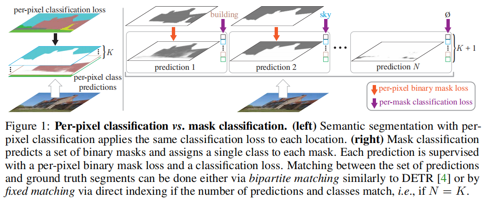
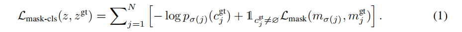
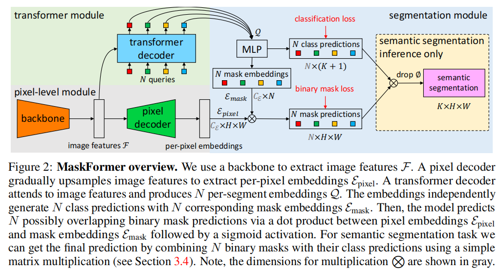

## `MaskFormer`：每个像素的分类并不是语义分割所需要的全部

### 0.摘要

现代方法通常将语义分割定义为每个像素的分类任务，而实例级分割则采用另一种掩码分类来处理。我们的关键见解是：掩模分类非常通用，可以使用完全相同的模型、损失和训练过程，以统一的方式解决语义级和实例级的分割任务。据此，我们提出了**`MaskFormer`**，一个简单的掩模分类模型，它预测一组二进制掩模，每个掩模与单个全局类标签预测相关联。总的来说，所提出的基于掩模分类的方法是简化了语义和全景分割任务的有效方法，并显示了良好的经验结果。特别是，我们观察到，**当类的数量较大时**，`MaskFormer`优于每像素的分类基线。我们的基于掩模分类的方法优于目前最先进的语义分割(`ADE20K`上的`55.6mIoU`)和全景分割(`COCO`上的`52.7PQ`)模型。

### 1.介绍

语义分割的目的是将图像划分为具有不同语义类别的区域。从`Longetal.`的全卷积网络(`FCNs`)工作开始，大多数基于深度学习的语义分割方法将语义分割定义为每像素分类（图1左），对每个输出像素应用分类损失。在这个公式中，每像素的预测很自然地将图像划分为不同类别的区域。

掩码分类是解决图像分割中分割和分类问题的另一种方法。基于掩码分类的方法不是对每个像素进行分类，而是预测一组二进制掩码，每个掩码都与单个类预测相关联（图1右）。更灵活的掩模分类在实例级分割领域中占主导地位。`MaskR-CNN`[21]和`DETR`[4]都对每个片段产生单一类预测，例如全景分割。相比之下，每个像素的分类假设有一个静态数量的输出，并且不能返回一个可变数量的预测区域/段，而这是实例级任务所必需的。

我们的主要观察是：掩码分类足够通用，可以解决语义和实例分割任务。事实上，在`FCN`[30]之前，表现最好的语义分割方法，如`O2P`[5]和`SDS`[20]，使用了掩码分类公式。从这个角度来看，一个很自然的问题出现了：一个单一的掩码分类模型能否是简化语义级和实例级分割任务的有效方法？这种掩码分类模型在语义分割方面能否优于现有的每像素分类方法？

为了解决这两个问题，我们提出了一种简单的`MaskFormer`方法，该方法可以无缝地将任何现有的每像素分类模型转换为掩模分类。利用`DETR`[4]中提出的集合预测机制，`MaskFormer`使用`Transformer`解码器[41]来计算一组对，每个对都由一个类预测和一个掩模嵌入向量组成。利用掩模嵌入向量，通过点积和每像素嵌入得到二进制掩模预测。新的模型以统一的方式解决了语义级和实例级的分割任务：不需要改变模型、损失和训练过程。具体来说，对于语义和全景分割任务，使用相同的每像素二进制掩模损失和每个掩模的单一分类损失。最后，我们设计了一个简单的推理策略，将`MaskFormer`的输出混合到一个任务依赖的预测格式中。

我们在5个不同类别的语义分割数据集上评估了模型：城市景观[15]（19类）、[34]（65类）、`ADE20K`[55]（150个类）、`COCOCOStuff-10K`[3]（171类）和`ADE20K-Full`[55]（847个类）。虽然`MaskFrorm`与城市景观的每像素分类模型相当，该模型有一些不同的类，但新模型在类别更大的数据集上表现出了优越的性能。我们假设每个掩模模型的单一类预测的细粒度识别优于每个像素的类预测。`MaskFromar`实现了`ADE20K`的新技术(`55.6mIoU`)，比具有相同主干的每像素分类模型[29]高出`2.1mIoU`，同时效率更高（参数减少10%，流量减少40%）。

最后，我们研究了使用`COCO`[28,24]和`ADE20K`[55]两个全视分割数据集：`COCO`[28,24]解决实例级任务的能力。具有相同主干和相同后处理的`MaskFormer`模型优于更复杂的`DETR`模型[4]。此外，`MaskFormer`在COCO上实现了最先进的`COCO(52.7PQ)`，比之前的最先进的[42]多出`1.6PQ`。我们的实验强调了`MaskFormer`统一实例和语义级分割的能力。

### 2.相关工作

每像素分类和掩模分类在语义分割中都得到了广泛的研究。在早期的工作中，小岸和`Yuille`[25]应用了基于局部图像统计的每像素贝叶斯分类器。然后，受早期非语义分组[13,36]研究的启发，基于掩码分类的方法开始流行起来，证明了在帕斯卡`VOC`挑战[18]中的最佳性能。`O2P`[5]和`CFM`[16]等方法通过对掩模建议[6,40,2]进行分类，取得了最先进的结果。2015年，`FCN`[30]将每像素分类的思想扩展到深度网，在`mIoU`（每像素的每像素分类度量）上显著优于之前的所有方法。

自全卷积网络(`FCNs`)[30]的开创性工作开始以来，每像素分类就成为了基于深度网络的语义分割的主导方式。现代语义分割模型侧重于在最终的特征图中聚合长期上下文：`ASPP`[7,8]使用具有不同间隙速率的间隙卷积；`PPM`[52]使用不同内核大小的池操作符；`DANet`[19]、`OCNet`[51]和`CCNet`[23]使用非本地块[43]的不同变体。最近，`SETR`[53]和分段器[37]用视觉`Transformer(ViT)`[17]取代了传统的卷积骨干，它可以从第一层开始捕获远程上下文。然而，这些一致的基于`Transformer`的[41]语义分割方法仍然使用每像素分类公式。注意，我们的`Transformer`模块可以将任何每像素分类模型转换为掩码分类设置，允许无缝地采用先进的每像素分类。

掩码分类通常用于实例级分割任务[20,24]。这些任务需要动态数量的预测，这使得每像素分类的应用具有挑战性，因为它假定一个静态的输出数量。著名的`MaskR-CNN`[21]使用全局分类器对掩码建议进行实例分割。`DETR`[4]进一步结合了一个`Transformer`[41]设计，以同时处理事物和东西分割的全视分割[24]。然而，这些掩码分类方法需要对边界框进行预测，这可能会限制它们在语义分割中的应用。最近提出的`Max-DeepLa`b[42]消除了条件卷积[39,44]对全景分割的边界框预测的依赖。然而，除了主要的掩码分类损失外，它还需要多个辅助损失(即实例识别损失、掩码-id交叉熵损失和标准的每像素分类损失)。

### 3.从每个像素到掩码的分类

在本节中，我们首先描述如何将语义分割表述为每像素分类或掩码分类问题。然后，我们在`Transformer`解码器[41]的帮助下，引入了掩模分类模型的实例化。最后，我们描述了一种简单的推理策略，它可以将掩码分类输出转换为任务依赖的预测格式。

#### 3.1 每像素的分类公式

对于每个像素的分类，一个分割模型的目的是预测一个$H×W$图像中每个像素的所有可能的$K$个类别上的概率分布：$y=\{p_i|p_i\in \triangle^K\}_{i=1}^{H\cdot W}$。这里$\triangle^K$是K维概率。训练一个每像素分类模型是直接的：给定真实类别标签$y_{gt}=\{y_i^{gt}|y_i^{gt}∈\{1，…K\}\}_{i=1}^{H\cdot W}$对于每个像素，通常应用每像素交叉熵（负对数似然）损失，$L_{\text pixel-cls}(y,y^{gt})=\sum_{i=1}^{H\cdot W}-\log p_i(y_i^{gt})$。

#### 3.2 掩码分类公式

掩码分类将分割任务分割为1)将图像分割/分组到$N$个区域($N$不需要等于$K$)，用二值掩码$\{m_i|m_i∈[0,1]^{H×W} \}^N_{i=1}$表示；2)将每个区域作为一个整体与$K$个类别上的一些分布联系起来。为了对一块分割区域进行联合分组和分类，即进行掩码分类，我们将期望的输出z定义为$N$个概率掩码对，即$z=\{(p_i，m_i)\}^N_{i=1}$。与每像素类概率预测相比，对于掩码分类，概率分布$p_i∈∆^{K+1}$除了包含$K$个类别标签外，还包含一个辅助的“无对象”标签（∅）。∅标签预测不对应任何$K$类别的掩码。注意，掩码分类允许使用相同的关联类进行多个掩码预测，这使其同时适用于语义级和实例级的分割任务。

为了训练一个掩模分类模型，需要在预测集$z$和$N^{gt}$真实标签之间建立一个匹配的$σ$,$z^{gt}=\{(c_i^{gt},m_i^{gt})|c_i^{gt}\in \{i,...,K\},m_i^{gt}\in \{0,1\}^{H×W}\}_{i=1}^{N^{gt}}$。这里$c^{gt}_i$是第$i$个地面真实段的地面真相类。由于预测集|z|=N和地面真值集$|z^{gt}|=N^{gt}$的大小一般不同，我们假设$N≥N^{gt}$并填充“无对象”令牌∅，以允许一对一匹配。

对于语义分割，如果预测的数量$N$与类别标签的数量$K$相匹配，则可能有一个简单的固定匹配。在这种情况下，第$i$个预测与类标签$i$的地面真实区域匹配，如果具有类标签$i$的区域不存在于真实标签中，则与$∅$匹配。在我们的实验中，我们发现基于二部匹配的分配比固定匹配显示出更好的结果。与`DETR`[4]使用边界框来计算匹配问题的预测$z_i$和地面真相$z_j^{gt}$之间的分配成本不同，我们直接使用类和掩码预测，即$−p_i(c^{gt}_j)+L_{\text mask}(m_i，m^{gt}_j)$，其中$L_{\text mask}$是一个二进制掩码损失。

为了训练模型参数，在给定匹配的情况下，主掩模分类损失$L_{\text mask-cls}$由每个预测段的交叉熵分类损失和二值掩模损失$L_{\text mask}$组成：

注意，大多数现有的掩码分类模型除了使用$L_{\text mask-cls}$外，还使用辅助损失（例如，边界框损失[21,4]或实例识别损失[42]）。在下一节中，我们将介绍一个简单的掩码分类模型，该模型允许单独使用$L_{\text mask-cls}$进行端到端训练。

#### 3.3 `MaskFormer`

现在我们介绍了`MaskFormer`，一种新的掩模分类模型，它计算了$N$个概率掩模对$z=\{(p_i，m_i)\}^N_{i=1}$。该模型包含三个模块（见图2）：1)一个像素级模块，提取用于生成二进制掩码预测的每像素嵌入；2)一个`transformer`模块，其中一堆`transformer`解码器层[41]计算$N$个每段嵌入；3)一个分割模块，它从这些嵌入中生成预测$\{(p_i，m_i)\}^N_{i=1}$。在推理过程中，在第二节中讨论。3.4、$p_i$和$m_i$被组合成最终的预测。

**像素级模块**以大小为$H×W$的图像作为输入。主干生成一个（通常的）低分辨率图像特征图$F∈\mathbb{R}^{C_F×\frac {H}{S}×\frac{W}{S}}$，其中$C_F$是通道数，S是特征图的步幅($C_F$取决于特定的主干，我们在本工作中使用S=32)。然后，像素解码器逐渐对特征进行上采样，生成每像素嵌入的$\epsilon_{\text pixel}∈\mathbb{R}^{C_\epsilon ×H×W}$，其中CE为嵌入维数。注意，任何基于每像素分类的分割模型都适合像素级模块设计，包括最近的基于变压器的模型[37,53,29]。前者将这样的模型无缝地转换为掩码分类。

**Transformer 模块**使用标准的`Transformer`解码器[41]从图像特征F和N个可学习的位置嵌入（即查询）计算其输出，即N每段嵌入$Q∈\mathbb {R}^{C_Q×N}$维$C_Q$，编码每个段的全局信息伪装前预测。编码每个段前预测的全局信息。与[4]类似，解码器可以并行地生成所有的预测。

**分割模块**在每个段嵌入Q上应用一个线性分类器，然后是一个softmax激活，为每个段产生类概率预测$\{p_i∈∆^{K+1}\}^N_{i=1}$。注意，如果嵌入不对应于任何区域，分类器会预测一个额外的“无对象”类别（∅）。对于掩模预测，具有2层的多层感知器(MLP)将每段嵌入Q转换为N个掩模嵌入维$C_E$的∈RCE×N。最后，我们通过第i个掩模嵌入和像素级模块计算的每个像素嵌入每像素像素之间的点积，得到每个二值掩模预测$mi∈[0,1]H×W$。点积之后是s型激活，即=s型激活(ipixel)。

注意，我们根据经验发现，不通过使用softmax激活来强制执行掩模预测相互排斥是有益的。在训练过程中，Lmask-cls损失结合了每个预测段的交叉熵分类损失和二值掩模损失Lmask。为了简单起见，我们使用与DETR[4]相同的Lmask，即焦点损失[27]和骰子损失[33]分别乘以超参数λfocal和λdice的线性组合。

#### 3.4 掩码分类推理

首先，我们提出了一个简单的通用推理过程，它将掩码分类输出{(pi，mi)}Ni=1转换为泛视或语义分割输出格式。然后，我们描述了一个专门为语义分割而设计的语义推理过程。我们注意到，推理策略的具体选择在很大程度上取决于评估度量，而不是任务。

一般推理通过argmaxi：ci6=∅pi(ci)·mi[h，mi[h，w]，将图像分割成分段。这里ci是每个概率掩模对=最可能的类标签=argmaxc∈{1，...，K，∅}pi(c)。直观地说，只有当最可能的类概率pi(ci)和掩模预测概率mi[h，w]都很高时，这个过程才将位置[h，w]的一个像素分配给概率掩模对i。分配给相同概率掩模对i的像素形成一个段，其中每个像素用ci标记。对于语义分割，共享相同类别标签的段被合并；而对于实例级分割任务，概率-掩模对的索引i有助于区分同一类的不同实例。最后，为了减少全视分割中的假阳性率，我们遵循了先前的推理策略[4,24]。具体来说，我们在推理之前过滤掉了低置信度的预测，并删除了那些被其他预测遮挡的大量二进制掩模(mi>0.5)的预测片段。

语义推理是专门为语义分割而设计的，并通过一个简单的矩阵乘法来完成。我们通过经验发现，概率掩模对的边缘化，即argmaxc∈{1，...，K}PNi=1pi(c)·mi[h，w]，比在一般推理策略中使用的每个像素到概率掩模对产生更好的结果。argmax不包括“无对象”类别（∅），因为标准的语义分割要求每个输出像素取一个标签。注意，该策略返回一个每像素类概率PNi=1pi(c)·mi[h，w]。然而，我们观察到，直接最大化每个像素类的可能性会导致糟糕的性能。我们假设，梯度均匀地分布到每个查询中，这使训练变得复杂。

### 4 实验

