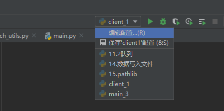
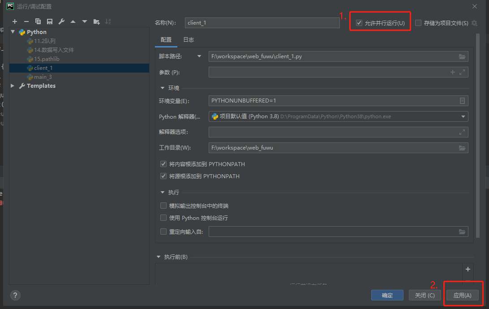
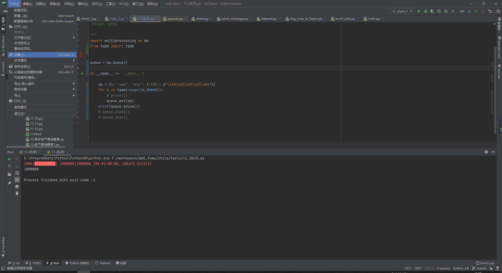
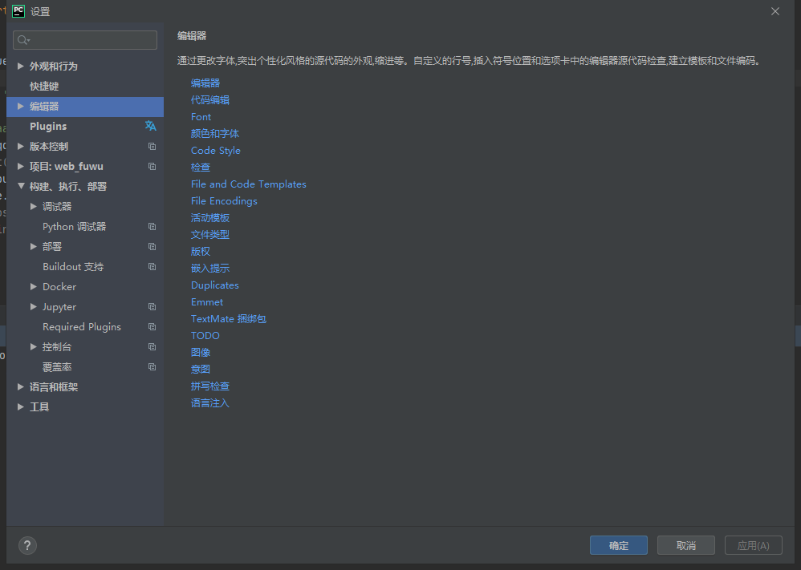
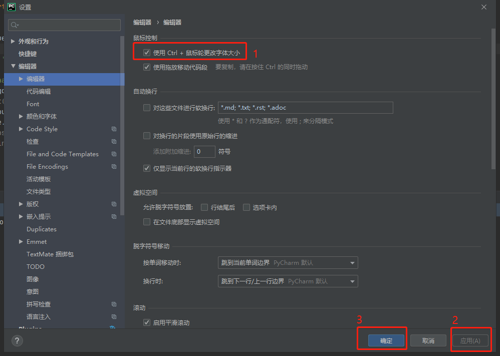
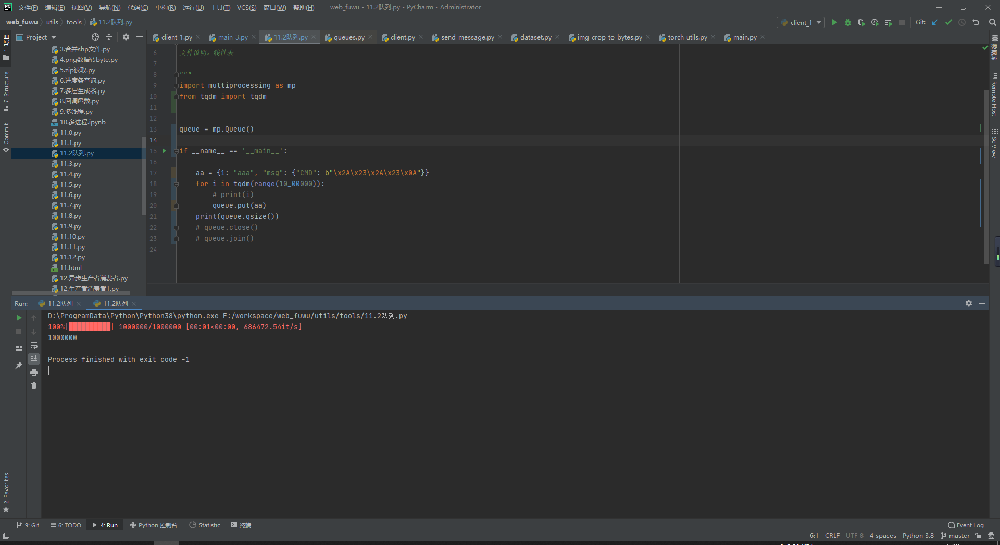

### pycharm同时运行一个py多次

1.选择`Edit Configurations.`

2.如下图所示

## pycharm如何设置滚动鼠标放大缩小字体

1. 打开pycharm界面

   

2. 

   1.点击左上角的File,弹出菜单

   2.点击Settings

   

3. 在弹出的对话框中，双击Editor

   

4. 点击General

   

5. 

   1.点击Change font size(Zoom) with Ctrl+Mouse Wheel前面的框框，让它打上勾勾

   2.点击Apply

   3.点击OK

   

6. 设置好后，按住ctrl+鼠标滚轮上滚就能放大字体，ctrl+鼠标滚轮下滚就能缩小字体

   

   