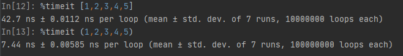

### 1.`python`变量
- 受保护的实例属性用单个下划线开头（后面会讲到）。
- 私有的实例属性用两个下划线开头（后面会讲到）。

### 2.元组

1.元组中的元素是无法修改的

2.元组在创建时间和占用的空间上面都优于列表

> **Note**
>
> 我们可以使用`sys`模块的`getsizeof`函数来检查存储同样的元素的元组和列表各自占用了多少内存空间，这个很容易做到。我们也可以在`ipython`中使用魔法指令`%timeit`来分析创建同样内容的元组和列表所花费的时间。



### 3.同步\异步and阻塞\非阻塞（重点）

#### 同步:

>**Note**
>
>所谓同步，就是在发出一个功能调用时，在没有得到结果之前，该调用就不会返回。按照这个定义，其实绝大多数函数都是同步调用。但是一般而言，我们在说同步、异步的时候，特指那些需要其他部件协作或者需要一定时间完成的任务。
>
>```python
>#1. multiprocessing.Pool下的apply #发起同步调用后，就在原地等着任务结束，根本不考虑任务是在计算还是在io阻塞，总之就是一股脑地等任务结束
>#2. concurrent.futures.ProcessPoolExecutor().submit(func,).result()
>#3. concurrent.futures.ThreadPoolExecutor().submit(func,).result()
>```

#### 异步：

>**Note**
>
>异步的概念和同步相对。当一个异步功能调用发出后，调用者不能立刻得到结果。当该异步功能完成后，通过状态、通知或回调来通知调用者。如果异步功能用状态来通知，那么调用者就需要每隔一定时间检查一次，效率就很低（有些初学多线程编程的人，总喜欢用一个循环去检查某个变量的值，这其实是一 种很严重的错误）。如果是使用通知的方式，效率则很高，因为异步功能几乎不需要做额外的操作。至于回调函数，其实和通知没太多区别。
>
>```python
>#举例：
>#1. multiprocessing.Pool().apply_async() #发起异步调用后，并不会等待任务结束才返回，相反，会立即获取一个临时结果（并不是最终的结果，可能是封装好的一个对象）。
>#2. concurrent.futures.ProcessPoolExecutor(3).submit(func,)
>#3. concurrent.futures.ThreadPoolExecutor(3).submit(func,)
>```

#### 阻塞：

> **Note**
>
> 阻塞调用是指调用结果返回之前，当前线程会被挂起（如遇到io操作）。函数只有在得到结果之后才会将阻塞的线程激活。有人也许会把阻塞调用和同步调用等同起来，实际上他是不同的。对于同步调用来说，很多时候当前线程还是激活的，只是从逻辑上当前函数没有返回而已。
>
> ```python
> #举例：
> #1. 同步调用：apply一个累计1亿次的任务，该调用会一直等待，直到任务返回结果为止，但并未阻塞住（即便是被抢走cpu的执行权限，那也是处于就绪态）;
> #2. 阻塞调用：当socket工作在阻塞模式的时候，如果没有数据的情况下调用recv函数，则当前线程就会被挂起，直到有数据为止。
> ```

#### 非阻塞：

> **Note**
>
> 非阻塞和阻塞的概念相对应，指在不能立刻得到结果之前也会立刻返回，同时该函数不会阻塞当前线程。

#### 小结：

1. 同步与异步针对的是函数/任务的调用方式：同步就是当一个进程发起一个函数（任务）调用的时候，一直等到函数（任务）完成，而进程继续处于激活状态。而异步情况下是当一个进程发起一个函数（任务）调用的时候，不会等函数返回，而是继续往下执行当，函数返回的时候通过状态、通知、事件等方式通知进程任务完成。

2. 阻塞与非阻塞针对的是进程或线程：阻塞是当请求不能满足的时候就将进程挂起，而非阻塞则不会阻塞当前进程

